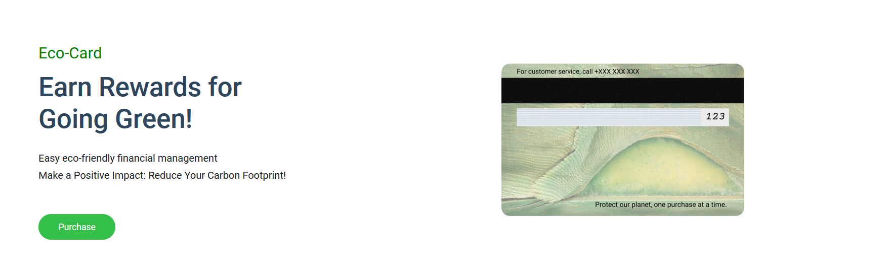
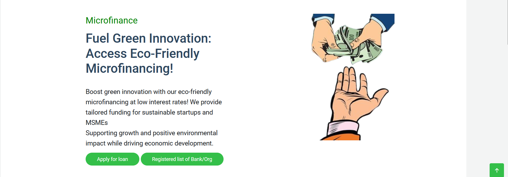

# Eco-Wealth
## Project Overview
Eco-Wealth is a **FinTech initiative** aimed at incentivizing individuals and businesses to adopt **eco-friendly practices** by offering **financial rewards and benefits**. The project focuses on leveraging financial tools to drive sustainable behaviors that contribute positively to the **environment**. It encourages customers to make **eco-conscious choices**, such as reducing carbon emissions, adopting renewable energy sources, or supporting sustainable products and services.

## Features
**Financial Incentives:-** Offering cashbacks, rewards, or discounts to customers who engage in eco-friendly activities.

**Bank Partnerships:-** Collaboration with banks to provide special green loans, eco-friendly investment options, or lower interest rates for customers who meet certain sustainability criteria.

**Tracking & Verification:-** Using digital platforms to track and verify the sustainability actions of customers, ensuring that the financial rewards are earned through genuine eco-friendly actions.

**Consumer Education:-** Promoting awareness about sustainable practices and their environmental impact through the platform.

## Technologies Used

**Programming Languages:-** HTML5, CSS, JavaScript

**Web Frameworks:-** Bootstrap5

**Data Base:-** Php

**Payment Systems:-** Payment Gateway(Razorpay)

**Tools:-** VsCode

